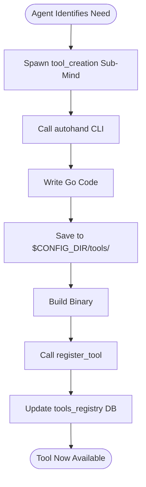

# HattieBot Self-Improvement Flows

These flowcharts illustrate how the agent extends its own capabilities.

---

## 1. Tool Creation Flow

When the agent needs a capability it doesn't have, it can create a new tool.

**Key Steps:**
1. Agent spawns `tool_creation` sub-mind (isolated context).
2. Sub-mind uses `autohand` CLI for complex code generation.
3. Builds binary with `go build` to `$CONFIG_DIR/bin`.
4. Registers via `register_tool`.
5. Tool becomes available for future calls.

---

## 2. Sub-Mind Creation Flow

When the agent needs a specialized reasoning mode.

**Key Steps:**
1. Agent defines new mode in `subminds.json` via `manage_submind`.
2. Specifies: allowed tools, system prompt, limits.
3. Uses `spawn_submind` to invoke it later.

---

## 3. LLM Provider Creation Flow

When the agent needs to use a new LLM provider.

**Key Steps:**
1. **Template path**: Write JSON spec for simple APIs via `manage_llm_provider`.
2. **Routing**: Use `manage_llm_provider` to update routing rules.

---

## 4. Self-Improvement Decision Tree

How the agent decides what to extend.

**Key Insight**: When blocked, the agent identifies the gap, uses `autohand` for complex code generation, creates the component, and retries.

---

## 5. Autohand Integration

`autohand` is an external AI coding CLI that handles complex workspace operations.

**Usage**: Agent sends instruction string, autohand executes in workspace, returns result. Used for tool creation, provider plugins, and complex refactoring.
